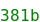

# stach

__Stach__ is a  __mustache-like__ string __templating__ system for __Node__ or __Browsers__.

```typescript
import { Stach } from "stach"

const templated = Stach("Hello {{name}} 😸", {name: "mr Bond"})
console.log( templated ) // Hello mr Bond 😸
```

## Concept

Why do we need __Stach__ with literal template strings available everywhere ?
Stach can be useful when any **small templating** is needed when **the template source is not coming from javascript** itself.
<br>For example, if you need to __process a template__ from a __user generated file__, __a dictionary__, or any other kind of input.

Stach is ultra-lightweight and compatible with Node and Browsers environments.
It uses Javascript's Regex based `String.replace` function to be **super effective**.
It's also compatible with multiline files / inputs.
Typescript definitions are included ✌️

### Scope

Stach can do __variable replacement__, __function calls__, and __short ternary evaluations__. **THAT'S IT.**<br>
It **cannot** do advanced conditions, listing, HTML transformations, etc...
If you need all of this, check others template engines like [Mustache](https://mustache.github.io/), [Handlebars](https://handlebarsjs.com/) or even [React JSX](https://fr.reactjs.org/docs/introducing-jsx.html) in some cases.

### Installation

To install Stach in your project :<br>
- NPM : `npm install stach`
- Yarn : `yarn add stach`

### Usage

If you are using CommonJS syntax :
```javascript
const { Stach } = require('stach')
```

Better, if ES-Modules syntax is available :
```javascript
import { Stach } from 'stach'
```

### Simple variable replacement

```javascript
Stach('Hello {{username}}', {
    username: 'James Bond'
});
// 'Hello James Bond'
```

### Values can be functions

```javascript
const user = { balance : 12 };
Stach('Your current balance is {{balance}}€', {
    balance: () => user.balance
});
// 'Your current balance is 12€'
```

### Ternary conditions can be used :

```javascript
Stach('Condition is {{test ? truthy : falsy}}', {
    test: 0
});
// 'Condition is falsy'
```

### Or, with the help of functions :
```javascript
Stach('{{name}} is {{age}} {{isAgePlural ? years : year}} old', {
    name: 'Brad Pitt',
    age: 55,
    // Note that v here is the current value object
    // So we can access dynamically to the age property
    isAgePlural: v => v.age > 1
});
// 'Brad Pitt is 55 years old'
```

### More functions

```javascript
Stach('{{plainFunction}} == 15', {
    value: 15,
	// This works
    plainFunction () {
        return this.value;
    }
});
// '15 == 15'
```

### Complex example mixing functions and ternaries

```javascript
const user = {
    name: 'James Bond',
    gender: 'male',
    balance: 15
}
Stach('Hello {{ isMale ? mr : mrs }} {{ getLastName }}. Your balance is {{ balance }}€.', {
  ...user,
  isMale: v => v.gender == 'male',
  getLastName: v => v.name.split(' ')[1]
});
// 'Hello mr Bond. Your balance is 15€.'
```

### Advanced, delimiters regex can be changed

Here is the default delimiter regex : `/{{(.*?)}}/gm` [see](https://github.com/zouloux/stach/blob/main/src/stach.ts#L5)

This will set delimiters from `{{var}}` to `{var}`.
Use [regexr.com](https://regexr.com) to create easily your delimiter's Regex.

```javascript
const singleCurlyRegex = /{(.*?)}/gm 	// regex for single curly braces
const template = 'Hello { username }' 	// template using single curly braces
const data = { username: 'Mr Bond' }
Stach( template, data, singleCurlyRegex ); // "Hello Mr Bond" 
```

### Unpkg

Stach is available on [unpkg](https://unpkg.com/stach)

Usage :
```html
<script src="https://unpkg.com/stach@1.0.0/dist/stach.es2017.min.js"></script>
<script>
	Stach("Hello from {{name}} !", { name: 'unpkg' })
</script>
```

### Built

__Stach__ is built from __typescript__ thanks to [tsbundle](https://github.com/zouloux/tsbundle)

### TODO / Not working

We need a way to escape `{{` when templating code-like files or simply keep not found variables.

Ex :
```typescript
const source = `
	...
	const Test{{FileName}} = "Source {{doNotReplace}}"
	...
`
Stach( source, {
	FileName : "Replace" 
})
```
will try to replace `{{doNotReplace}}` which is something to keep in output.